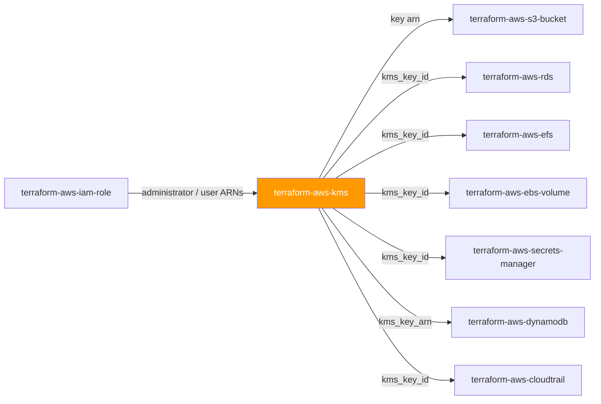
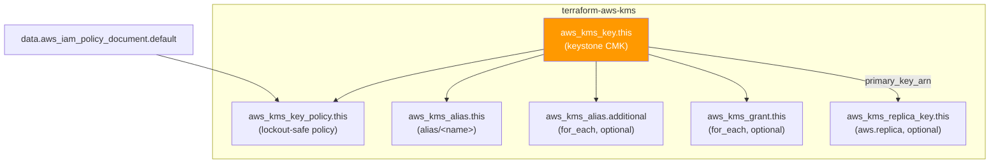

# 🟧 AWS **KMS** Terraform Module

> **A secure-by-default customer-managed KMS key (CMK) — rotation-enabled, lockout-safe key policy, friendly aliases, optional grants, and an optional multi-Region replica, all from one module call.** Built for the AWS provider **v6.x**.


---

## 🧩 Overview

- 🔐 Creates a **customer-managed KMS key** (`aws_kms_key`) — the encryption foundation consumed across the AWS suite.
- 🔄 **Automatic key rotation ON** by default (`enable_key_rotation = true`) with an optional custom rotation period.
- 🏷️ Builds a friendly primary **alias** (`alias/<name>`) plus any number of additional aliases pointing at the same key.
- 🛡️ Attaches a **lockout-safe key policy** — either your verbatim JSON or a secure default assembled from administrator / user / service-principal inputs, always anchored by an account-root `kms:*` safety floor.
- 🎟️ Optional **grants** (`map(object)`, `for_each`) for narrow, encryption-context-scoped delegation to principals and AWS services.
- 🌎 Optional **multi-Region replica** (`aws_kms_replica_key`) in a DR Region via a provider alias.
- ⏳ **Safe deletion window** (30 days default) — destroying a key only *schedules* deletion.

> 💡 **Why it matters:** an unencrypted datastore is the single largest blast-radius mistake in a regulated FI. This module makes the *encrypted, rotation-enabled, lockout-safe* posture the path of least resistance, so every downstream S3 bucket, RDS instance, and secret wires to a real CMK by default.

---

## ❤️ Support this project

If these Terraform modules have been helpful to you or your organization, I'd appreciate your support in any of the following ways:

- ⭐ **Star this repository** to help others discover this Terraform module.
- 🤝 **Connect with me on LinkedIn:** [linkedin.com/in/microsoftexpert](https://www.linkedin.com/in/microsoftexpert)
- ☕ **Buy me a coffee:** [buymeacoffee.com/microsoftexpert](https://buymeacoffee.com/microsoftexpert)

Whether it's a star, a professional connection, or a coffee, every gesture helps keep these modules actively maintained and continually improving. Thank you for being part of the community!

---

## 🗺️ Where this fits in the family



KMS is a **foundation** module: it consumes only IAM principal ARNs (administrators / users / grantees) and is consumed widely by every stateful, encryption-aware module downstream.

---

## 🧬 What this module builds



| Resource | Role | Created when |
|---|---|---|
| `aws_kms_key.this` | Keystone CMK | Always |
| `aws_kms_key_policy.this` | Resource policy on the key (managed separately from the key to avoid drift) | Always |
| `aws_kms_alias.this` | Primary `alias/<name>` | Always |
| `aws_kms_alias.additional` | Extra aliases (`for_each`) | `additional_aliases` non-empty |
| `aws_kms_grant.this` | Programmatic grants (`for_each`) | `grants` non-empty |
| `aws_kms_replica_key.this` | Multi-Region replica in the `aws.replica` Region | `replica != null` |

> ℹ️ The key policy is applied via the dedicated `aws_kms_key_policy.this` resource rather than the key's inline `policy` argument. Setting both causes perpetual drift; the key is created with KMS's transient default policy, then immediately overwritten.

---

## ✅ Provider / Versions

| Requirement | Version |
|---|---|
| Terraform | `>= 1.12.0` |
| `hashicorp/aws` | `>= 6.0, < 7.0` |

The module declares **two** provider configurations via `configuration_aliases = [aws, aws.replica]`. The caller always passes both — see [Quick Start](#️-quick-start).

---

## 🔑 Required IAM Permissions

The Terraform identity needs the following actions. Scope to the key ARN where possible (the key ARN is not known until create time, so `kms:CreateKey` is necessarily `Resource: "*"`).

| Action | Required for | Notes |
|---|---|---|
| `kms:CreateKey` | Key creation | Cannot be resource-scoped (no ARN yet) |
| `kms:DescribeKey` | Read-back / plan refresh | — |
| `kms:ScheduleKeyDeletion`, `kms:CancelKeyDeletion` | Destroy | Deletion is **scheduled**, not immediate |
| `kms:EnableKeyRotation`, `kms:DisableKeyRotation`, `kms:GetKeyRotationStatus` | Automatic rotation control | Secure default enables rotation |
| `kms:PutKeyPolicy`, `kms:GetKeyPolicy` | Key-policy management (`aws_kms_key_policy`) | Principal must also be allowed by the key policy itself |
| `kms:CreateAlias`, `kms:DeleteAlias`, `kms:UpdateAlias`, `kms:ListAliases` | Alias lifecycle | Primary + additional aliases |
| `kms:CreateGrant`, `kms:RetireGrant`, `kms:RevokeGrant`, `kms:ListGrants` | Optional grants | `RetireGrant` only when `retire_on_delete = true` |
| `kms:ReplicateKey`, `kms:UpdatePrimaryRegion` | Multi-Region replica | In **both** primary and replica Regions |
| `kms:TagResource`, `kms:UntagResource`, `kms:ListResourceTags` | Tagging | Key and replica |

> ℹ️ **No `iam:PassRole` is required.** Administrator, user, and grantee principals are *referenced by ARN* in the policy and grants — the Terraform identity never assumes them.
>
> ⚠️ **No service-linked role** is auto-created by KMS. KMS does not provision an SLR.

---

## 📋 AWS Prerequisites

- **Service:** KMS is enabled in every account and Region by default — no account-level opt-in required.
- **Service-linked role:** none required for KMS.
- **Multi-Region replica:** the primary key must be created with `multi_region = true` *before* a replica can be made of it. The replica is created in a **different Region** through the `aws.replica` provider alias — you cannot replicate into the primary's own Region.
- **Key-policy lockout:** every key policy must grant the account root (or a break-glass principal) `kms:*`, or the key can become permanently unmanageable. The module's default policy bakes in this statement; a custom `var.policy` must preserve it unless you knowingly set `bypass_policy_lockout_safety_check = true`.
- **Region:** the key inherits the caller's provider Region — there is **no `region` variable** on the primary. The replica's Region is set by the `aws.replica` provider alias.
- **Quotas** (Service Quotas, raisable):
 - **100,000** customer-managed keys per account per Region.
 - **50,000** grants per CMK.
 - Asymmetric/HMAC key specs and signing throughput have separate request-rate quotas.

---

## 📁 Module Structure

```text
terraform-aws-kms/
├── providers.tf # required_providers + configuration_aliases = [aws, aws.replica]
├── variables.tf # name, key config, policy inputs, aliases, grants, replica, tags
├── main.tf # aws_kms_key.this + policy + aliases + grants + replica
├── outputs.tf # id, key_id, arn, alias_*, key_policy, grant_*, replica_*, tags_all
├── README.md # this file
└── SCOPE.md # in/out-of-scope, IAM, prerequisites, gotchas, design decisions
```

---

## ⚙️ Quick Start

Smallest working call — a single-Region, rotation-enabled CMK with a friendly alias:

```hcl
module "kms" {
  source = "git::https://github.com/microsoftexpert/terraform-aws-kms?ref=v1.0.0"

  name        = "app-data"
  description = "Encrypts application data at rest."

  # configuration_aliases requires BOTH providers, even single-Region.
  # Point the replica at the same provider when no replica is used.
  providers = {
    aws         = aws
    aws.replica = aws
  }

  tags = {
    Environment = "prod"
    CostCenter  = "1234"
  }
}

# Wire the key ARN straight into a downstream encrypted resource:
# kms_key_arn = module.kms.arn
```

> ⚠️ Always pin the source with `?ref=v1.0.0` — never a branch.

---

## 🔌 Cross-Module Contract

### Consumes

| Input | Type | Source module |
|---|---|---|
| `key_administrators` | `list(string)` (IAM ARNs) | `terraform-aws-iam-role` / `terraform-aws-iam-user` |
| `key_users` | `list(string)` (IAM ARNs) | `terraform-aws-iam-role` |
| `grants[*].grantee_principal` | `string` (IAM ARN) | `terraform-aws-iam-role` |
| `key_service_principals` | `list(string)` (service principals) | n/a (AWS service names) |

> KMS is a **foundation** module — it consumes nothing from other infrastructure modules, only IAM principal ARNs.

### Emits

| Output | Description | Consumed by |
|---|---|---|
| `id` / `key_id` | Key id (UUID) | `kms_key_id` inputs on RDS, EBS, DynamoDB |
| `arn` | Key ARN — the canonical cross-resource reference | S3 SSE-KMS, RDS/Aurora, EFS, Secrets Manager, CloudTrail |
| `alias_name` | `alias/<name>` | Console / CLI references |
| `alias_arn` | Primary alias ARN | Services that accept an alias ARN |
| `additional_alias_arns` | Map of extra alias name → ARN | Multi-name lookups |
| `key_policy` | Effective key-policy JSON | Audit / review |
| `grant_ids` | Map of grant key → grant id | Grant management |
| `grant_tokens` | Map of grant key → grant token (**sensitive**) | Programmatic grant use |
| `replica_arn` / `replica_key_id` | Replica key ARN / id (null unless multi-Region) | DR-Region consumers |
| `tags_all` | All tags incl. provider `default_tags` | Governance / audit |

---

## 📚 Example Library

<details>
<summary><strong>1 · Minimal — single-Region rotation-enabled CMK</strong></summary>

```hcl
module "kms" {
  source = "git::https://github.com/microsoftexpert/terraform-aws-kms?ref=v1.0.0"

  name = "app-data"

  providers = {
    aws         = aws
    aws.replica = aws
  }
}
```
</details>

<details>
<summary><strong>2 · With tags (merges with provider <code>default_tags</code>)</strong></summary>

```hcl
# Provider-level default_tags are the CALLER's concern, set once:
provider "aws" {
  region = "us-east-1"
  default_tags {
    tags = {
      ManagedBy = "Terraform"
      Owner     = "platform-team"
    }
  }
}

module "kms" {
  source = "git::https://github.com/microsoftexpert/terraform-aws-kms?ref=v1.0.0"

  name = "app-data"

  # Resource tags MERGE with default_tags; resource tags win on key conflict.
  tags = {
    Environment = "prod"
    DataClass   = "PII" # overrides any default_tags DataClass
  }

  providers = {
    aws         = aws
    aws.replica = aws
  }
}

# module.kms.tags_all == { ManagedBy, Owner, Environment, DataClass }
```
</details>

<details>
<summary><strong>3 · Secure default policy from administrators / users (recommended)</strong></summary>

```hcl
module "kms" {
  source = "git::https://github.com/microsoftexpert/terraform-aws-kms?ref=v1.0.0"

  name        = "app-data"
  description = "App data CMK with delegated admin + usage."

  # Wired from terraform-aws-iam-role outputs — module assembles a lockout-safe policy.
  key_administrators = [module.kms_admin_role.arn]
  key_users          = [module.app_role.arn]

  providers = {
    aws         = aws
    aws.replica = aws
  }
}
```
</details>

<details>
<summary><strong>4 · Allow an AWS service principal (CloudWatch Logs)</strong></summary>

```hcl
module "logs_kms" {
  source = "git::https://github.com/microsoftexpert/terraform-aws-kms?ref=v1.0.0"

  name = "cloudwatch-logs"

  key_users              = [module.app_role.arn]
  key_service_principals = ["logs.amazonaws.com"]

  providers = {
    aws         = aws
    aws.replica = aws
  }
}

# Feed the key into a log group:
# kms_key_id = module.logs_kms.arn
```
</details>

<details>
<summary><strong>5 · Customer-managed KMS for an S3 bucket (cross-module wiring)</strong></summary>

```hcl
module "bucket_kms" {
  source = "git::https://github.com/microsoftexpert/terraform-aws-kms?ref=v1.0.0"

  name = "bucket-sse"

  providers = {
    aws         = aws
    aws.replica = aws
  }
}

module "bucket" {
  source      = "git::https://github.com/microsoftexpert/terraform-aws-s3-bucket?ref=v1.0.0"
  bucket_name = "casey-app-data"

  # SSE-KMS with the customer-managed key
  kms_key_arn = module.bucket_kms.arn
}
```
</details>

<details>
<summary><strong>6 · Additional aliases pointing at one key</strong></summary>

```hcl
module "kms" {
  source = "git::https://github.com/microsoftexpert/terraform-aws-kms?ref=v1.0.0"

  name = "shared"

  # "alias/" prefix optional — the module normalizes it.
  additional_aliases = ["shared-legacy", "alias/shared-reporting"]

  providers = {
    aws         = aws
    aws.replica = aws
  }
}
```
</details>

<details>
<summary><strong>7 · Programmatic grant with an encryption-context constraint</strong></summary>

```hcl
module "kms" {
  source = "git::https://github.com/microsoftexpert/terraform-aws-kms?ref=v1.0.0"

  name = "grant-demo"

  grants = {
    app-decrypt = {
      grantee_principal = module.app_role.arn
      operations        = ["Decrypt", "DescribeKey"]
      constraints = {
        encryption_context_equals = { Department = "Finance" }
      }
    }
  }

  providers = {
    aws         = aws
    aws.replica = aws
  }
}
```
</details>

<details>
<summary><strong>8 · Custom rotation period</strong></summary>

```hcl
module "kms" {
  source = "git::https://github.com/microsoftexpert/terraform-aws-kms?ref=v1.0.0"

  name                    = "fast-rotate"
  enable_key_rotation     = true
  rotation_period_in_days = 90 # 90–2560; null uses the AWS default of 365

  providers = {
    aws         = aws
    aws.replica = aws
  }
}
```
</details>

<details>
<summary><strong>9 · Asymmetric signing key (SIGN_VERIFY)</strong></summary>

```hcl
module "signing_key" {
  source = "git::https://github.com/microsoftexpert/terraform-aws-kms?ref=v1.0.0"

  name                     = "doc-signing"
  key_usage                = "SIGN_VERIFY"
  customer_master_key_spec = "RSA_4096"
  enable_key_rotation      = false # asymmetric keys cannot rotate

  providers = {
    aws         = aws
    aws.replica = aws
  }
}
```
</details>

<details>
<summary><strong>10 · HMAC key (GENERATE_VERIFY_MAC)</strong></summary>

```hcl
module "hmac_key" {
  source = "git::https://github.com/microsoftexpert/terraform-aws-kms?ref=v1.0.0"

  name                     = "token-mac"
  key_usage                = "GENERATE_VERIFY_MAC"
  customer_master_key_spec = "HMAC_256"
  enable_key_rotation      = false # HMAC keys cannot rotate

  providers = {
    aws         = aws
    aws.replica = aws
  }
}
```
</details>

<details>
<summary><strong>11 · Full custom key policy (verbatim JSON)</strong></summary>

```hcl
data "aws_iam_policy_document" "key" {
  statement {
    sid       = "EnableRootAccountPermissions" # keep a lockout-safe statement!
    effect    = "Allow"
    actions   = ["kms:*"]
    resources = ["*"]
    principals {
      type        = "AWS"
      identifiers = ["arn:aws:iam::111122223333:root"]
    }
  }
  #... your additional statements...
}

module "kms" {
  source = "git::https://github.com/microsoftexpert/terraform-aws-kms?ref=v1.0.0"

  name = "custom-policy"

  # When set, key_administrators/key_users/key_service_principals are IGNORED.
  policy = data.aws_iam_policy_document.key.json

  providers = {
    aws         = aws
    aws.replica = aws
  }
}
```
</details>

<details>
<summary><strong>12 · Multi-Region primary + DR replica (provider alias)</strong></summary>

```hcl
provider "aws" {
  region = "us-east-1" # primary
}

provider "aws" {
  alias  = "us_west_2" # DR Region for the replica
  region = "us-west-2"
}

module "kms" {
  source = "git::https://github.com/microsoftexpert/terraform-aws-kms?ref=v1.0.0"

  name         = "dr-data"
  multi_region = true # REQUIRED before a replica can exist

  replica = {
    description             = "DR replica of dr-data."
    deletion_window_in_days = 14
    tags                    = { Role = "dr" }
  }

  providers = {
    aws         = aws           # primary Region (us-east-1)
    aws.replica = aws.us_west_2 # replica Region (us-west-2)
  }
}

# DR-Region resources encrypt against:
# module.kms.replica_arn
```
</details>

<details>
<summary><strong>13 · Secure-by-default opt-out (rotation off + short deletion window) — EXCEPTION</strong></summary>

```hcl
# ⚠️ Weakens the baseline. Document the exception and get sign-off.
module "kms" {
  source = "git::https://github.com/microsoftexpert/terraform-aws-kms?ref=v1.0.0"

  name                    = "legacy-compat"
  enable_key_rotation     = false # OPT-OUT: rotation disabled (discouraged)
  deletion_window_in_days = 7     # OPT-OUT: minimum recovery window

  providers = {
    aws         = aws
    aws.replica = aws
  }
}
```
</details>

<details>
<summary><strong>14 · End-to-end composition — IAM → KMS → RDS (mandatory finale)</strong></summary>

```hcl
# 1) Roles that administer and use the key
module "kms_admin_role" {
  source             = "git::https://github.com/microsoftexpert/terraform-aws-iam-role?ref=v1.0.0"
  name               = "kms-admin"
  assume_role_policy = data.aws_iam_policy_document.admin_trust.json
}

module "db_role" {
  source             = "git::https://github.com/microsoftexpert/terraform-aws-iam-role?ref=v1.0.0"
  name               = "rds-monitoring"
  assume_role_policy = data.aws_iam_policy_document.rds_trust.json
}

# 2) The CMK — administered and used by the roles above
module "db_kms" {
  source = "git::https://github.com/microsoftexpert/terraform-aws-kms?ref=v1.0.0"

  name               = "rds-storage"
  description        = "Encrypts the application RDS instance at rest."
  key_administrators = [module.kms_admin_role.arn]
  key_users          = [module.db_role.arn]

  tags = { Environment = "prod", DataClass = "PII" }

  providers = {
    aws         = aws
    aws.replica = aws
  }
}

# 3) RDS encrypts at rest with the customer-managed key
module "rds" {
  source            = "git::https://github.com/microsoftexpert/terraform-aws-rds?ref=v1.0.0"
  identifier        = "app-db"
  storage_encrypted = true
  kms_key_id        = module.db_kms.arn # ARN is the cross-resource reference
}
```
</details>

---

## 📥 Inputs

> ℹ️ High-level grouping below.

- **Core:** `name` (primary identity; builds `alias/<name>`), `description`, `is_enabled`.
- **Key spec (FORCE-NEW):** `key_usage`, `customer_master_key_spec`, `multi_region`.
- **Rotation:** `enable_key_rotation` (default `true`), `rotation_period_in_days`.
- **Lifecycle / safety:** `deletion_window_in_days` (default `30`), `bypass_policy_lockout_safety_check` (default `false`).
- **Policy:** `policy` (verbatim JSON; when set, the next three are ignored), `key_administrators`, `key_users`, `key_service_principals`.
- **Aliases:** `additional_aliases`.
- **Grants:** `grants` — `map(object)` keyed by stable name (all fields FORCE-NEW).
- **Replica:** `replica` — nullable object; requires `multi_region = true` and the `aws.replica` provider.
- **Universal:** `tags`.

---

## 🧾 Outputs

- `id` / `key_id` — the key UUID.
- `arn` — the key ARN (the canonical cross-resource reference).
- `alias_name`, `alias_arn` — primary alias name and ARN.
- `additional_alias_arns` — map of extra alias name → ARN (empty when none).
- `key_policy` — the effective key-policy JSON.
- `grant_ids` — map of grant key → grant id (empty when no grants).
- `grant_tokens` — map of grant key → grant token. **`sensitive = true`** — grant tokens are bearer credentials.
- `replica_arn`, `replica_key_id` — `try(..., null)`: **null** unless a replica is created.
- `tags_all` — merged resource + provider `default_tags`.

---

## 🧠 Architecture Notes

- **ARN / id formats.**
 - Key ARN: `arn:aws:kms:<region>:<account>:key/<uuid>`
 - Key id: a bare UUID (`1234abcd-...`) — same value as `id`.
 - Alias ARN: `arn:aws:kms:<region>:<account>:alias/<name>`
 - Most encryption inputs accept either the **key ARN** or an **alias ARN**; prefer the key ARN for clarity over the bare UUID.
- **Force-new / immutable fields.** `key_usage`, `customer_master_key_spec`, and `multi_region` are **FORCE-NEW** on the key — changing any recreates the key (and a recreate schedules the old key for deletion). **All `grants[*]` fields are FORCE-NEW** — editing a grant recreates it. Changing `name` replaces the **alias**, not the key.
- **`tags` ↔ `tags_all` ↔ `default_tags`.** `var.tags` flows to the key and replica. `tags_all` is the computed merge of resource tags over the provider's `default_tags`; **resource tags win** on key conflict. `default_tags` is set in the caller's provider block, never inside the module. Aliases, the key policy, and grants are **not taggable**.
- **Eventual consistency.** A freshly created IAM principal referenced in the key policy may not yet be resolvable — KMS validates principals at `PutKeyPolicy` time and can transiently fail; re-apply succeeds once the principal propagates. Grant tokens exist to bridge the window before a new grant is fully consistent.
- **Destroy ordering.** Destroying the key **schedules** deletion after `deletion_window_in_days` (7–30, default 30) rather than deleting immediately — data encrypted under the key is **unrecoverable** once deletion completes. The replica must be deleted before its primary's Region binding changes; Terraform's graph orders alias/policy/grant teardown ahead of the key.
- **Multi-Region & us-east-1.** KMS keys are **regional** (no us-east-1 global constraint). A multi-Region *primary* can have replicas in other Regions; the replica's Region is set by the `aws.replica` provider alias. Replicas share the primary's key id and key material.

---

## 🧱 Design Principles

Secure-by-default posture — each hardened default and the exact variable that relaxes it:

| Posture | Hardened default | Opt-out (variable) |
|---|---|---|
| Automatic key rotation | `enable_key_rotation = true` | `enable_key_rotation = false` (discouraged; required `false` for asymmetric/HMAC) |
| Deletion recovery window | `deletion_window_in_days = 30` | lower toward the `7` minimum |
| Lockout safety floor | account-root `kms:*` statement always present in the default policy | **non-negotiable** — a custom `var.policy` must preserve it; `bypass_policy_lockout_safety_check = true` to override |
| Key spec | `SYMMETRIC_DEFAULT`, `key_usage = ENCRYPT_DECRYPT` | `customer_master_key_spec` / `key_usage` for asymmetric / HMAC |
| Region footprint | single-Region (`multi_region = false`) | `multi_region = true` + `replica = {... }` |
| Policy least-privilege | administrators administer, users use, services scoped via `kms:GrantIsForAWSResource` | full custom `var.policy` |
| Secret exposure | grant tokens output marked `sensitive = true`; key material never emitted | n/a |

Additional principles:
- **One composite, one CMK.** The key, alias(es), policy, grants, and replica come from a single call — no hand-wiring four resources.
- **Policy managed off the key.** `aws_kms_key_policy` owns the policy, never the key's inline `policy`, to avoid perpetual drift.
- **Optional features are absent unless configured.** Grants (`{}`) and the replica (`null`) materialize only when supplied.

---

## 🚀 Runbook

```bash
terraform init -backend=false
terraform validate
terraform fmt -check

# plan/apply require valid AWS credentials (profile / SSO / OIDC) and a region:
terraform plan
terraform apply
terraform output
```

> ⚠️ Pin the module source with `?ref=v1.0.0` — never a branch.
> ℹ️ Because `configuration_aliases` is declared, every call **must** pass `providers = { aws =..., aws.replica =... }`, even single-Region (point both at the same provider).

---

## 🧪 Testing

- `terraform init -backend=false && terraform validate` — offline schema validation.
- `terraform fmt -check` — formatting gate.
- `terraform plan` against a sandbox account — confirm the default policy renders the expected statements (`EnableRootAccountPermissions`, `AllowKeyAdministration`, `AllowKeyUsage`, `AllowGrantsForAWSResources`, `AllowServicePrincipalUsage`).
- Verify `enable_key_rotation` shows `true` and `aws kms get-key-rotation-status` reflects it after apply.
- For multi-Region: confirm `replica_arn` is populated and the replica shares the primary's key id.

---

## 💬 Example Output

```text
Apply complete! Resources: 3 added, 0 changed, 0 destroyed.

Outputs:

alias_arn = "arn:aws:kms:us-east-1:111122223333:alias/app-data"
alias_name = "alias/app-data"
arn = "arn:aws:kms:us-east-1:111122223333:key/1a2b3c4d-5e6f-7890-abcd-ef1234567890"
id = "1a2b3c4d-5e6f-7890-abcd-ef1234567890"
key_id = "1a2b3c4d-5e6f-7890-abcd-ef1234567890"
tags_all = {
 "DataClass" = "PII"
 "Environment" = "prod"
 "ManagedBy" = "Terraform"
}
```

---

## 🔍 Troubleshooting

- **Tag drift from `default_tags` overlap.** A key set in both `var.tags` and provider `default_tags` shows the resource value in `tags_all` (resource wins). If a plan keeps re-adding a tag, it is defined in both places with different values — remove the duplicate.
- **Credential-chain failures.** `NoCredentialProviders` / `ExpiredToken` on plan/apply means no valid AWS credentials — set `AWS_PROFILE`, refresh SSO, or confirm the OIDC role assumption succeeded in CI.
- **`MalformedPolicyDocumentException` referencing a principal.** A principal ARN in the policy (often a just-created role) is not yet resolvable — IAM eventual consistency. Re-apply, or add an explicit dependency on the role.
- **Key becomes unmanageable / `AccessDenied` on `PutKeyPolicy`.** A custom `var.policy` omitted the account-root `kms:*` statement and locked the key. Recovery requires AWS Support unless a break-glass principal retained access — **always** keep the lockout-safe statement.
- **Replica errors.** `replica requires multi_region = true` (variable validation) — set `multi_region = true` on the primary. `KMSInvalidStateException` / "cannot replicate into the same Region" — the `aws.replica` provider must target a **different** Region than `aws`.
- **`ValidationException` on rotation.** Rotation is only valid for `SYMMETRIC_DEFAULT` keys — set `enable_key_rotation = false` for asymmetric / HMAC specs.
- **Deletion seems to "hang".** Destroying a key schedules deletion after `deletion_window_in_days`; the key shows `PendingDeletion`, not gone. Use `kms:CancelKeyDeletion` (or `terraform apply` after reverting) within the window to recover.
- **IAM permission denials.** A `kms:CreateKey`/`kms:PutKeyPolicy` denial means the Terraform identity lacks the action — see [Required IAM Permissions](#-required-iam-permissions). Note `PutKeyPolicy` requires the principal be allowed by the key policy *and* hold the IAM action.

---

## 🔗 Related Docs

- Terraform Registry — `aws_kms_key`, `aws_kms_key_policy`, `aws_kms_alias`, `aws_kms_grant`, `aws_kms_replica_key`
- AWS KMS Developer Guide — key policies, grants, automatic key rotation, multi-Region keys
- AWS KMS Developer Guide — scheduling and canceling key deletion
- AWS Service Quotas — KMS resource and request-rate quotas
- module suite — `terraform-aws-iam-role`, `terraform-aws-s3-bucket`, `terraform-aws-rds`, `terraform-aws-secrets-manager`

---

> 🧡 *"Infrastructure as Code should be standardized, consistent, and secure."*
